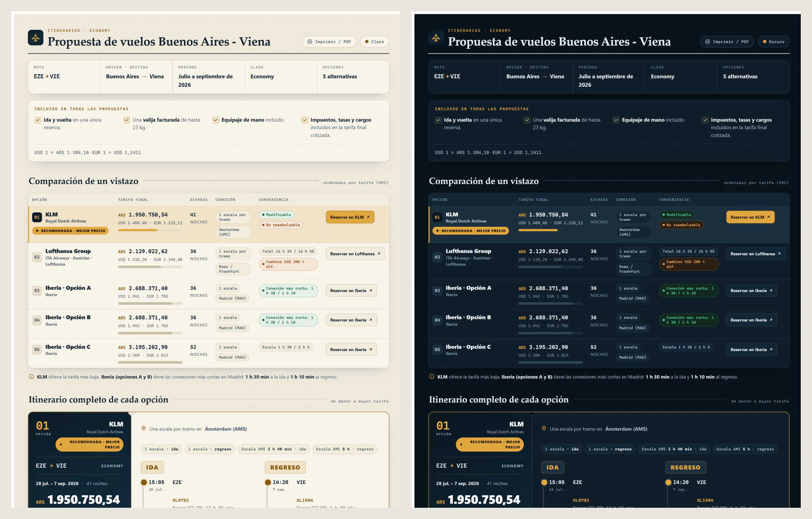
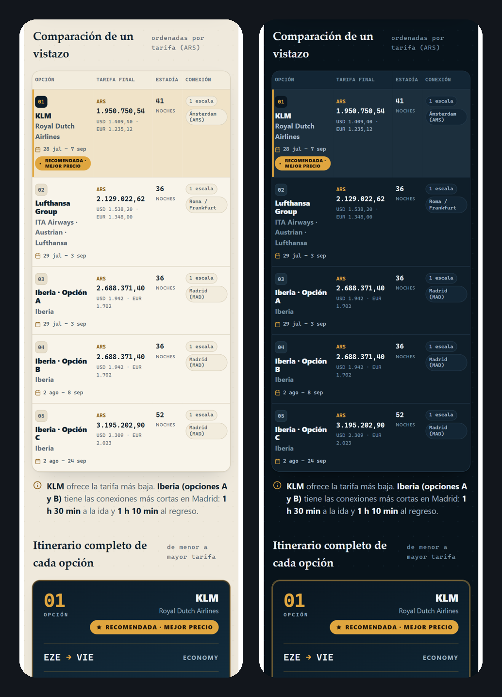

# Flight Quote Presentation · Buenos Aires ✈ Vienna

> **A client-facing proposal tool for travel agencies.** It turns a raw flight quote into
> a polished, shareable web page that a travel agent sends to their client to present the
> options and close the booking — five itinerary alternatives ranked by **price and
> convenience**, with full per-segment detail and direct booking links.
> Modeled on a **real client scenario** (Amadeus / GDS-style data) and built to production
> quality, not as a throwaway demo.


**🔗 Live demo:** https://tinatechpro.github.io/flight-quote-presentation/

**🌎 Localized for the Hispanic travel market** — interface in Spanish (`es-AR`), for
travel agencies in Argentina / LATAM. English or a multi-locale build would be a natural
next step.



---

## Context — the problem it solves

Travel agencies usually send flight quotes as screenshots, chat messages or plain PDFs:
hard to compare, easy to lose, and far from the image an agency wants to project. This is
the deliverable an agent hands to a client **instead** — one link, every option side by
side, ranked, with the recommended fare highlighted and one-tap access to each airline's
official booking page. No app, no login; it works on any device and prints to a clean A4 PDF.

- **Audience:** travel agencies and their clients (LATAM / Hispanic market).
- **The job it does:** present a flight budget clearly enough that the client decides fast.
- **Where it fits:** the "proposal" step of an agency's sales flow, after pulling fares
  from a GDS and before issuing the ticket.

## Responsive — mobile-first, light & dark



The at-a-glance comparison reflows from a full table on desktop into a **compact, scannable
layout on phones** (no horizontal scrolling), and every view is tuned for **both light and
dark** themes.

## Highlights

- **Decision-first UX.** A comparison table surfaces fare, dates, nights, stops and
  convenience at a glance; the lowest fare is flagged as *recommended* and the airline with
  the shortest connections is called out — so the client decides in seconds.
- **Boarding-pass itineraries.** Each option expands into a per-leg timeline: times,
  airports, terminals, flight numbers, aircraft and layovers.
- **Light & dark themes.** Token-based, with a clear switch; contrast audited to **WCAG AA**
  in both themes. Defaults to light for a predictable first impression when shared.
- **Print / PDF as a first-class layout.** A dedicated `@media print` + `@page A4`
  stylesheet paginates cleanly for a professional export the agency can attach or send.
- **Zero dependencies, fully self-contained.** One `index.html`; all CSS and JS inline, no
  external requests. Loads instantly and works offline.

## Engineering decisions

- **A design system, not ad-hoc styles.** CSS custom properties drive palette, type scale
  and spacing. A theme is a *token swap*, not a second copy of the rules — which keeps dark
  mode consistent and maintainable.
- **Accessibility by default.** Semantic landmarks, `scope`-ed table headers, visible focus,
  `aria` where it adds meaning, `prefers-reduced-motion`, and contrast verified in both themes.
- **Print treated as design, not an afterthought.** The screen layout *reflows* for A4
  instead of dumping the desktop view onto paper.
- **Content integrity.** Every fare, date, flight number, terminal and link mirrors the
  source quote verbatim — no invented data.

## Tech stack

Vanilla **HTML5 · CSS3 · JavaScript** — no framework, no build step, no libraries.
Flexbox/Grid layout, CSS custom properties, `@media` (responsive, dark, print) and a small
progressive-enhancement script for the theme switch.

## Run locally

Open `index.html` directly, or serve the folder:

```bash
python -m http.server 8000    # then open http://localhost:8000
```

---

**Designed & developed by [Ernestina D'Amico](https://github.com/Tinatechpro) — Web Developer.**

_Sample quote data (July 2026), for demonstration purposes._
